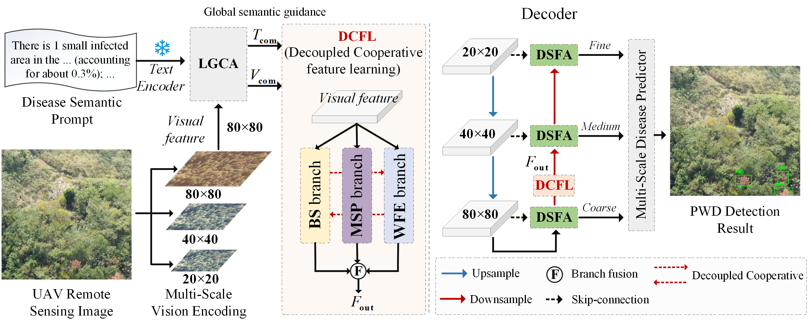

# Multi-Level Decoupling and Coordination of Text-Guided Visual Representation for UAV-Based Pine Wilt Disease Detection

## :evergreen_tree: Overview

- **Research Background**：Pine Wilt Disease (PWD) poses a devastating threat to global forest ecological security. Accurate detection of infected trees is critical, yet pure visual methods often confuse diseased trees with visually similar objects. Vision-language models can introduce helpful textual prior knowledge, but they generally suffer from interference by task-irrelevant redundant textual information, leading to misaligned cross-modal features. The fundamental challenge is twofold: how to suppress cross-modal redundancy and how to prevent the attenuation of early weak features that are crucial for identifying subtle disease symptoms.
<div align="center">
    
</div>
- **Technical route**：First, pure visual detection confuses infected trees with similar-looking objects. To resolve such confusion, text modality is introduced to provide discriminative semantics. Simultaneously, a global compression strategy removes task-irrelevant redundancy, yielding global semantic guidance fused with text. Second, early weak lesion features are easily lost as the network deepens. To counteract that attenuation, global semantic guidance is leveraged to decouple feature learning, collaboratively strengthening features from two aspects: mining fine-grained details and reactivating subtle early lesion cues. Finally, multi-scale fusion risks re-attenuating the strengthened features. A bidirectional detail-semantic aggregation is therefore applied to preserve these features, thus closing the loop.
- **Core innovation**：
  - We have constructed the first vision-language dataset specifically for PWD detection, which covers four different ecological regions across three typical affected provinces in China and includes UAV remote sensing images captured from multiple perspectives and under various lighting conditions.
  - Through deep collaborative reasoning between visual features and text semantics, this work overcomes the limitations of existing methods in both cross-modal redundancy suppression and early weak feature enhancement. Extensive experiments on a self-built PWD dataset demonstrate that the proposed VT-DCNet achieves excellent detection performance, excelling particularly in complex scenarios where diseased trees are heavily mixed with the background.
  - By systematically evaluating the impact of text differing in correlation  on PWD detection, we found that structured text outperformed natural language text in terms of model convergence speed and detection accuracy. These findings indicate that, for scenarios such as UAV-based disease detection, text that structurally integrates spatial orientation and visual attributes can provide more direct and efficient semantic guidance to visual models. 
 
## :card_file_box:Datasets
<div align="center">
    
</div>

## :fallen_leaf: Visualization
<details open>
  <summary>self-built PWD</summary>
  <div align="center">
    
  </div>
</details>

## :computer: Installation
<details open>
  <summary>Dependency installation steps</summary>
  
  1. **Clone this project and create a conda environment:**
     ```bash
     git clone https://github.com/TechJots-Liu/CF-SCSNet.git
     cd CF-SCSNet
     
     conda create -n cf_scsnet python=3.10.9
     conda activate cf_scsnet
  2. **Install pytorch and torchvision matching your CUDA version:**
     ```bash
     pip install torch==1.13.1+cu117 torchvision==0.14.1+cu117 torchaudio==0.13.1 --extra-index-url https://download.pytorch.org/whl/cu117
  3. **Install requirements:**
     ```bash
     pip install -r requirements.txt
  4. **Load the Roberta word encoder locally**
     [Roberta-base](https://huggingface.co/FacebookAI/roberta-base)


